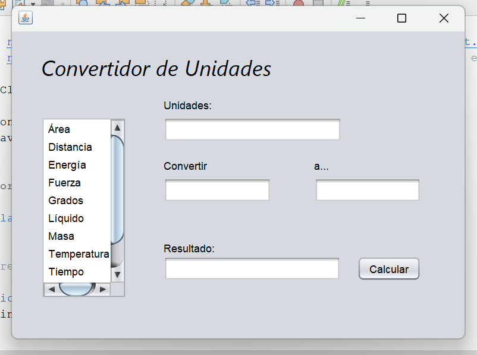
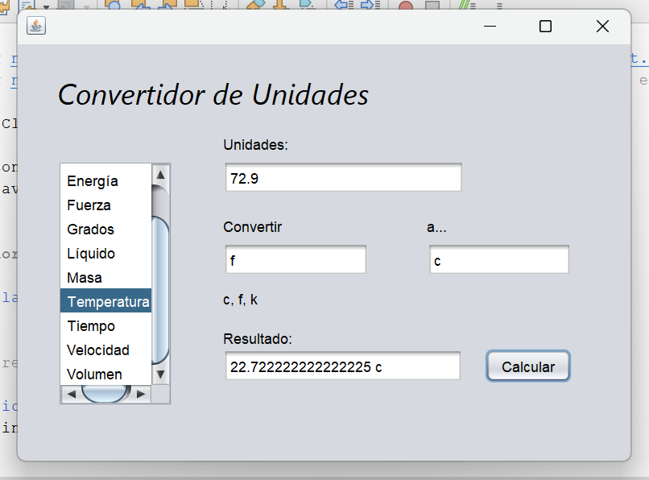
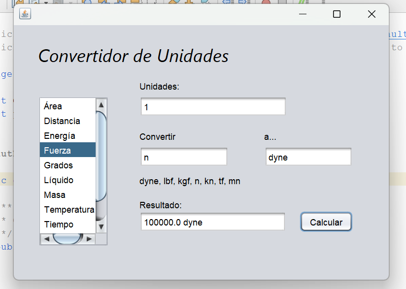
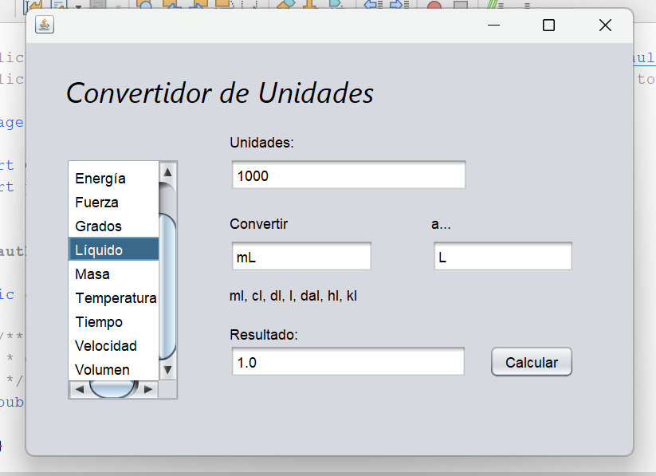
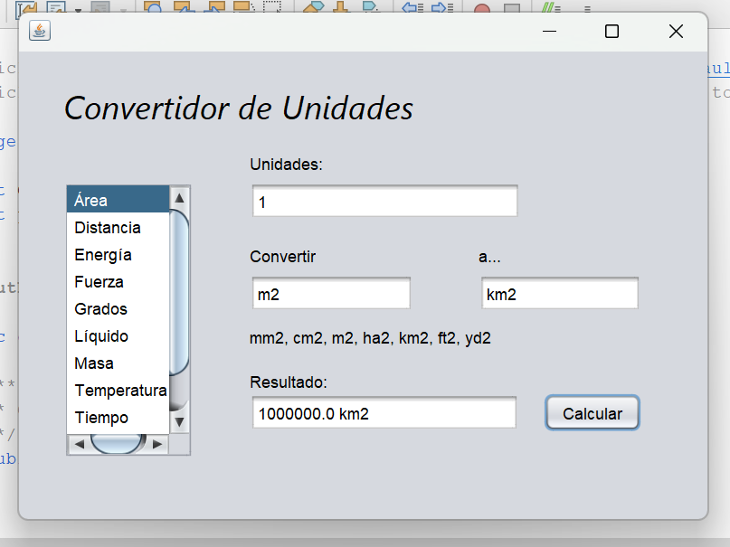

# Libreria de conversion de unidades

Esta librería en Java permite convertir entre distintas unidades de medida mediante métodos organizados en clases especializadas. Incluye una interfaz gráfica creada con `JFrame` para facilitar su uso.

# Clases disponibles

- `Masa`: Convierte unidades entre miligramos, decigramos, centigramos, gramos, decagramos, hectogramos,  kilogramos, toneladas.
- `Volumen`: Convierte unidades entre kilometro cubico, hectometro cubico, decametro cubico, metro cubico, centimetro cubico, milimetro cubico, etc.
- `Área`: Convierte unidades entre metros cuadrados, centimetros cuadrados, milimetros cuadrados, kilometros cuadrados, hectareas cuadrados, etc.
- `Líquido`: Converte unidades entre unidades líquidas (litro, mililitro, decilitro, centilitro, decalitro, etc).
- `Energía`: Converte unidades entre unidades de energia (joules, calorias, kilocalorias, etc).
- `Fuerza`: Converte unidades entre unidades de fuerza (Dyne, libra-fuerza, kilogramo-fuerza, newton, etc).
- `Velocidad`: Converte unidades entre unidades de velocidad (metros/segundos, millas/horas, pies/segundos, etc).
- `Distancia`: Converte unidades entre unidades de distancia (metros, kilometros, hectometros, decametros, decimetros, centimetros, etc).
- `Grados`: Converte unidades entre unidades de grados (grados, radianes, grados con minutos y segundos, etc).
- `Temperatura`: CConverte unidades entre unidades de temperatura (fahrenheit, celsius kelvin).
- `Tiempo`: Converte unidades entre unidades de energia (segundos, minutos, horas, dias, semanas, meses, años, etc).

# Funcionamiento del código

Cada clase tiene métodos con nombres como `convertir[mas simbolo de la unidad empezando por mayuscula](valor, unidadDestino)`. Estos métodos:
- Reciben un valor double (que es el valor a comvertir) y un String con el simbolo de la unidad destino para el valor.
- Si la unidad destino no se reconoce, el método devuelve -1.
- Si la unidad destino es válida, devuelve el un double con el valor convertido a la unidad destinado.

Ejemplo:

double resultado = Masa.convertirKg(1000, "mg"); // Esto convierte 1000 kg a miligramos

## Validaciones

- La unidad destinado se compara en minúsculas utilizando `toLowerCase()` para la entrada en unidadDestino.
- Si el nombre de la unidad destino no coincide con las esperadas, retorna -1.
- En algunos casos se validan valores negativos (según el tipo de unidad como la temperatura).

# Instrucciones para importar el `.jar` en otro proyecto

1. Descarga el archivo `.jar` desde este repositorio.
2. Abre tu proyecto en tu entorno de desarrollo (NetBeans, Eclipse, IntelliJ, BlueJ, etc.).
3. Agrega el `.jar` a tu proyecto:
   - `Eclipse / IntelliJ`: Click derecho en el proyecto -> Build Path -> Add External JARs...
   - `NetBeans`: Boton derecho sobre Libraries -> Add JAR/Folder
   - `BlueJ`: Project -> Use Library -> Agrega el archivo '.jar'
4. Ya puedes importar y usar las clases de la librería con líneas como:

//// java
import Convertidor.*; // para importar todas la clase o el nombre de alguna clase para importar uno en especifico.

Temperatura temp = new Temperatura();

double resultado = temp.convertirCelsius(72.9, "f"); // convierte 72.9 grados Celsius a Fahrenheit

# Capturas del JFrame mostrando el uso

--- A continuación, se muestran algunas imágenes de la interfaz gráfica:

# Enlace al video en YouTube

👉 [Ver video en YouTube](https://www.youtube.com/watch?v=AN5hlwElR_M)

# Colaboradores

[Álvarez Martínez Alessandro Santiago] (https://github.com/AleSantiagoAM)

[Velasco Velasco Heber] (https://github.com/EverV774)
